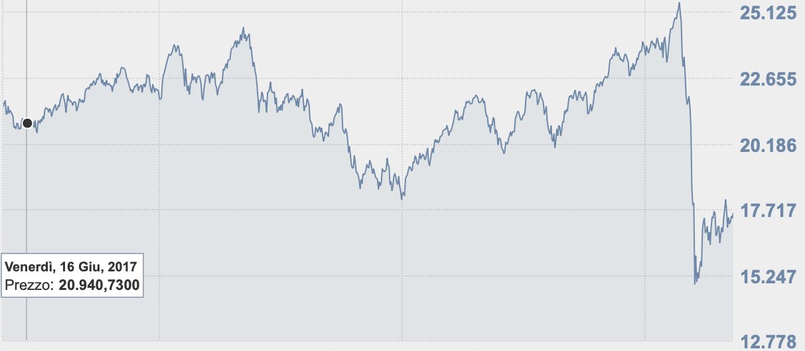
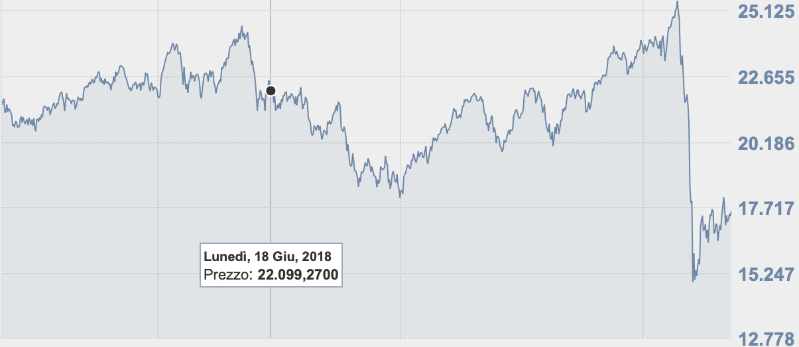
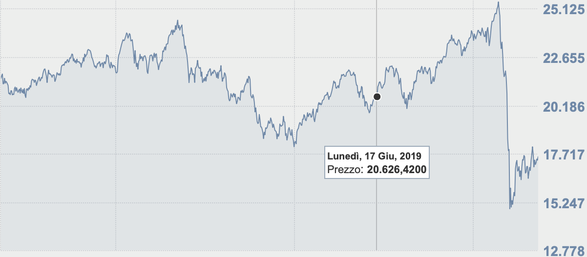

# Patterns in foreign sims connected to OpenWiFi-Milan  {-}

Author: Bernardi Riccardo - 864018

Professor: Isadora Antoniano-Villalobos

\newpage
\tableofcontents
\newpage
<!-- \listoffigures -->
<!-- \newpage -->
<!-- \listoftables -->
<!-- \newpage -->

```{r include = FALSE}
knitr::opts_chunk$set(fig.width=10, fig.height=5, fig.path='Figs/',
                      echo=FALSE, warning=FALSE, message=FALSE)

rm(list=ls())
```


# Introduction & Motivation

The project is about finding if some patterns are present in the way foreign people connects to the wifi of the city of Milan in Italy. This wifi was installed in the first days of august of the 2014 but the data if from the $5^{th}$ of July od the 2015. It was installed by the municipality of the city and it is public but it is only available in some areas of the city. We can see here below that the areas covered are the most attractive from the point of view of a tourist so for this reason we can believe that this is a good proxy for the number of people in the city.


It permits to a user that is logged in to use the free wifi for a maximum time of 60 minutes and 300MB of downloaded data. These restrictions are huge for a people living and working there but probably for a tourist that remains few days it can be enough. Obviously the wifi was created in a time in which the telecom companies were digging gold with high prices on internet connection but at the time I'm writing(year 2020) the fees are much much lower and the roaming no more exists. FO all these reasons we can agree with the fact that as the time goes on the public wifi is going to be abandoned. This comes easily by the fact that all the people will be able to afford an internet connection on the smartphone.[1]

Now I'm going to tell the reader how works the data we have: we have two columns, the first one is the day in which the relevation occurred and the second column is about how many sim cards from foreign people were connected. I would like to let the reader knows that no NANs are present and there is exactly one observation per day. These facts are good because the time serie is easier to be analyzed if all the data is present, if some data was missing then are needed complex assumptions that can be also not valid. Th enumber of sims(the second column) is about the number of sims from all the possible countries in the world. We know that each sim is uniquely identified by the system so if the second columns tells us that 12 sims are connected in a certain date it means that exactly 12 unique and different sims are connected. These are all good facts but we cannot state that all the sims are independent one from the others, for example a group of tourists or a fmaily coming to visit the city should be counted as only one element or more? Until now they are counted separately since every sim is identified uniquely. Another problem that insist on the dataset is that there is no way to know in which part of the city the sims connected.

Is interesting to analyse this kind od data? Obviously yes! The city of Milan was the first city providing a free wifi and it is already now the only one that provides the relative data in the form of open data. This kind of initiatives in Italy are pretty rare so it worths to be studied. We should also remind that in the city are present many boutiques that are of great interest for the foreign people, public events about fashion, luxury and design, music events on the beaches near to Milan and so on. After these also we should remind that in the city is also present the italian stock exchange market and so it can be really interesting to investigate if a certain then in the city is linked to some events in the relative stock exchange market.


# Data Inspection

The dataset comes from the open data provided by all the municipalities of Milan. This repository is available at dati.gov.it. From this repository I selected the data going from June of 2017 to October of the 2019.

Characteristics of the DataSet:

- the dataset contains 2 columns "Date, Number_of_Foreign_Sims"
- has 868 rows
- Dates goes from from 05/06/17 to 30/10/19 (~2 years)
- the datasets have no NA
- no lacking days
- the "Number_of_Foreign_Sims" is a discrete variable about total number of foreign sims in a certain Date connected to the OpenWifi of Milan


```{r}
setwd("~/Documents/GitHub/STDA-project-proposal")
set.seed(25061997)

require(zoo)
require(xts)
data <- read.csv("opendatamilano2017.csv",sep = ";")
data <- rbind(data, read.csv("opendatamilano2018.csv",sep = ";"))
data <- rbind(data, read.csv("opendatamilano2019.csv",sep = ";"))

data$prefix <- NULL
data$country <- NULL
data$num <- NULL
data$total.ita.sim <- NULL

ll <- aggregate.data.frame(data$total.foreign.sim,by=list(data$date),FUN=mean)
names(ll)[2] <- "total.foreign.sim"
names(ll)[1] <- "Date"
data <- ll
```

Here we can read which are the most important numbers for the data, these are called the Tukey's five numbers and they are the minimum that is also important to check if there are errors in the data since it should be greater or equal to zero. Zero seems infeasible and it can be a NAN. The data we can read here below are not bad in the sense that no negative values are present but we can note that the space spanned by maximum - minimum is very large, probably the time serie suffers of great variability. The variability is a measure to calculate the volatility of a stock option. If the volatility is high this means the analysis will be more difficult for us since the stationarity is an assumptions for the model we are going to see in the next chapters.

```{r}
print("minimum, lower-hinge, median, upper-hinge, maximum)")
fivenum(data$total.foreign.sim)
```

We can check here the histogram of the data and we can see that the data is a bit skewed. In the technical jergon skewness is a measure of the fact that the data in the histogram is not symmetric over a certain accumulation point. For us the accumulation point is the mean and we can see it approximatively on the 100. We can note that the right tail is longer than the left tail. The skewness is not an appreciable characteristic for the time serie since it means that calculating the mean can have no sense and no assumptions on gaussianoty is feasible. Skewness also means that probaly constant variance assumption is not feasible and so no stationarity assumption can hold. These are all difficult facts to deal with. What we can do to cope with this problem? We can try to stabilize the data trying some transformations and checking which is the best one to have a more symmetrical distribution.

```{r}
hist(data$total.foreign.sim)
```

Here we are going to check the Nans and as we can see they are not present, this is a good fact because it means that there is non need of doing assumptions on the way missing values behave.

```{r}
cat("number of nans in the date column: ", sum(is.na(data$Date)),"\n")
cat("number of nans in the foreign sims column: ", sum(is.na(data$total.foreign.sim)),"\n")
```

The mean of the values as stated before id around 100 and it is confirmed here below but it is useless to calculate it if the distribution is skewed.

```{r}
cat("mean of the foreign sims column: ", mean(data$total.foreign.sim),"\n")
mean.data <- mean(data$total.foreign.sim)
```

Also the variance is calculated here:

```{r}
cat("mean of the foreign sims column: ", sd(data$total.foreign.sim),"\n")
sd.data <- sd(data$total.foreign.sim)
```

Elements that are good in our ts stand between mean$\pm$std

```{r}
up.m.sd <- mean.data + sd.data
lo.m.sd <- mean.data - sd.data

cat("upper confidence value of the foreign sims column: ", up.m.sd,"\n")
cat("lower confidence value of the foreign sims column: ", lo.m.sd,"\n")
```

We are going here to check the outliers with the boxplot, also called the whisker's plot. It is useful for example here in this case to see that there are many outliers on the upper part and no outliers on the lower part. This mean that there are many off-scale values that are too big. This is not a certainty but the boxplot is a good tool for outliers analysis. It is applied on the column of the foreign sims.

```{r}
boxplot(data$total.foreign.sim, xlab="Foreign sims")
```

```{r}
#last5[last5<lo.m.sd] <- mean.data
#data$total.foreign.sim[seq(from=length(data$total.foreign.sim)-5, to=length(data$total.foreign.sim), by=1)] <- last5

#data$total.foreign.sim[data$total.foreign.sim<low.outlier] = mean.data
#data$total.foreign.sim[data$total.foreign.sim>hi.outlier] = mean.data
```

We know from an introspection of the data that at the end of the time serie are present some near-to-zero data due to some errors in the measuring way so we are going to eliminate them.

```{r}
last5 <- data$total.foreign.sim[seq(from=length(data$total.foreign.sim)-6, to=length(data$total.foreign.sim), by=1)]
cat("here the data to investigate on:",last5,"\n")

cat("old length of the vector:", length(data$total.foreign.sim), "\n")
last5 <- data$total.foreign.sim[seq(from=length(data$total.foreign.sim)-2, to=length(data$total.foreign.sim), by=1)]
cat("here the data to be deleted:",last5,"\n")

data <- data[-seq(from=length(data$total.foreign.sim)-2, to=length(data$total.foreign.sim), by=1),]
cat("new length of the vector:", length(data$total.foreign.sim), "\n")

last5 <- data$total.foreign.sim[seq(from=length(data$total.foreign.sim)-2, to=length(data$total.foreign.sim), by=1)]
cat("the new last3 elements are:",last5,"\n")
```

```{r}
first5 <- data$total.foreign.sim[seq(from=0, to=6, by=1)]
cat("here the data to investigate on:",first5,"\n")

#cat("old length of the vector:", length(data$total.foreign.sim), "\n")
#last5 <- data$total.foreign.sim[seq(from=length(data$total.foreign.sim)-2, to=length(data$total.foreign.sim), by=1)]
#cat("here the data to be deleted:",last5,"\n")

#data <- data[-seq(from=length(data$total.foreign.sim)-2, to=length(data$total.foreign.sim), by=1),]
#cat("new length of the vector:", length(data$total.foreign.sim), "\n")

#last5 <- data$total.foreign.sim[seq(from=length(data$total.foreign.sim)-2, to=length(data$total.foreign.sim), by=1)]
#cat("the new last3 elements are:",last5,"\n")
```

We choose here to transform the data from the original scale to the square root scale. The transformation was chosen after many empirical tries with the most promising ones.

```{r}
cat("before the transformation(data [0:5]):",data$total.foreign.sim[0:5],"\n")
data$total.foreign.sim <- sqrt(data$total.foreign.sim)
cat("after the transformation(data [0:5]):",data$total.foreign.sim[0:5],"\n")
```

The hist after the transformation here below. As we can see it in better than before, in the sense that now it is bell-shaped so calculating the mean and the standard deviation is meaningful. The only requirement is that at the end the reult is put to the power of two since this is a transformation of the original data.

```{r}
hist(data$total.foreign.sim)
```

Now the boxplot is better because the overall number of outliers is less.

```{r}
boxplot(data$total.foreign.sim)
```

# Time serie Analisys

```{r}
require(xts)
data$Date <- as.Date(data$Date, format = "%Y-%m-%d")
#typeof(data$date[1])
data.xts <- xts(data$total.foreign.sim, order.by=data$Date, frequency = 7)
data.ts <- ts(data$total.foreign.sim, frequency = 7)
```

Here below the time serie is built and as we can see there are present many peaks, those days in whuch the peak is present are days of unexpected increase of connections and we hope this is a good proxy for an incremented number of foreign people in the city of Milan. The peaks are explained in few lines of text but we can imagine that some important events in the city are involved such as the fashion week. We can also note only from this graph that the overall number of connections decrease on the first days of december and it restart rapidly with a plateau until september(excluding peaks). We can so hypotesize a seasonality of one year for the data but since we have too few data to recognize a 1 year seasonality we are going to use a week seasonality. We attempted with all the possible seasonalities and this was the best and also the most explainable. For example a seasonality of 1 month is not sensible with this kind of data since every month is very different from the others. A seasonality of a week instead is useful to find the most frequented days of the week.

```{r}
main <- "foreign sim per day"
ylab<-"Tot of sim in that day"
plot(data.xts,ylab=ylab,main=main)
```


```{r}
#main <- "foreign sim per day"
#ylab<-"Tot of sim in that day"
#plot(data.ts,ylab=ylab,main=main)
```


Here we can see the whole time serie folded on a week. Before doing this folding operation we checked that the $5^th$ of June is a Monday, that is our starting point. This is because is otherwise an offset would should be applied to rescale. We can note that the most frequented days are the friday and saturday. It is not a great news but it can be important for the sellers to know quantitatively how much they can sell on the days of the week.

```{r}
boxplot(data.ts~cycle(data.ts),names=c("Mo","Tu","We","Th","Fr","Sa","Su"))
```

## Peaks Explanation

Many peaks are present and we are going here to explain some of them, the most important ones.

```{r}
a <- max(data$total.foreign.sim)
b <- data$Date[data$total.foreign.sim==a]
cat("the highest number of connected sims happened in the days:",b,"\n")
```

As we can read here above the greatest number of connections happened on the $17^{th}$ of June for the years provided and we know that such days are dedicated to the fashion week but also we know that on the $17^{th}$ of June of 2017 the famous band of the Blink182 gave a concert in Milan. We also know that the year 2017 is the one in which the automatic roaming were approved encouraging people travelling. But it is not all done we have here below a list of the most influential events that happened in the critical days.

- automatic roaming [2]
- arch. week [5]
- it was a saturday![6]
- it was the orient festival [6]
- many music events, samsara of papetee and others, folk's festivals, discounts [7]
- fashion week on 2017-06-17 [8]
- blink 182 concert on 2017-06-17 [9]

We would also like to search for a linkage between these dates and the FTSE-MIB index on these days, check below[10].
We can note that in the 2017 and 2019 the date(17/06) is in both cases a plateau and after that day the value of the index start increasing. In the case of the year 2018 it is not true this fact and so it can be an exception or ot can be that this linkage with this exchance index is not valid, this is only an experiment and it can be repeated with other indexes to find a correlation. This is important because an interesting correlation between this kind of data and the stock market can be of interest for the population.








Now It is interesting to find the trend to recognise if it is going to increase or decrease. In both case it is interesting to discuss because it can be that people is encouraged to use more the personal internet or a personal hotspot due to the decreasing cost of the tariff plans. For example it is possible that on the long run the public wifi will be avoided by people bacause of no need, of low security or slow network or restrictions on use.

```{r}
tt<-as.numeric(time(data.ts))
fit2<-lm(data.ts~poly(tt,degree=2,raw=TRUE))
fit4<-lm(data.ts~poly(tt,degree=8,raw=TRUE))

main <- "foreign sim per day"
plot(data.ts,ylab=ylab,main=main)
lines(tt,predict(fit2),col='red',lwd=2)
lines(tt,predict(fit4),col='blue',lwd=2)
legend("bottomright",legend = c("2nd order","4th order"),lwd=2,lty=1,col=c("red","blue"))
```

Here we are going to smooth the data since there are many outliers that can decrease the overall performance of the model. This is not a problem since the outliers were explained before through a deep search of the events that caused them to be outliers.

```{r}
require(fpp)
require(forecast)
trendpattern = timeSeries::filter(data.ts, filter = rep(1/15,15), sides=2)
plot(data.ts, main = "moving average annual trend")
lines(trendpattern,col="red")
```

Some NaNs in this plot are present so we omit them. This is becuase of the fact that the mean is not defined on the all time serie but only in the central part, the borders are undefined.

```{r}
seasonality <- data.ts - trendpattern
cat("number of nans: ",sum(is.na(seasonality)),"\n")
seasonality <- na.omit(seasonality)
plot(seasonality)
```

Now we split the data for being able to test on them

```{r}
require(TSstudio)
split <- ts_split(ts.obj = data.ts, sample.out = 100)

data.ts <- split$train
testing <- split$test

cat("train size:",length(data.ts),"\n")
cat("test size:",length(testing),"\n")
```

# Models

We tried many models, the most known is the arma but we investigated also the possibility of using the VAR but it is only for more than one response variable and the Garch in many variants such as the rugarch and the fgarch. These last two variants of the garch were pretty interesting for us because they are able to model the residuals with a non-constant variability. At the end we decided to drop these kind of models because of the increased complexity and the more difficult interpretability. We also would like to model the data with an LSTM model but we are not doing it right now because these kind of models have no explanation at all. After this it is known that they are very well performing.

We searched for more than one seasonlity with the msts/mstl functions investigating a lot of possibilities such as jointly to have a weekly, monthly, quarterly, annual seasonalities. We also tried many others such as every 180 days, every 35 days and so on. These experiments were conducted to search the best seasonlity using as a comparison method the residuals and the relative measures on the stationarity of the residuals such as the Ljiung-Box and the Box-Jenkins. These were experiments and we found no good improvements so we decided to go into more preprocessing as the reader can read in the previous chapters.

## Arima

To find the best arima in a such complicate time serie we are going to exploit a grid search algorithm done via the auto arima function provided by the fpp package. This is not the cheapest way of doing but after many and many acf and pacf difficult to be read we decided to use this tool. It is going to search for all the most feasible combinations of the parameters (p,d,q) fot the non-seasonal part and the (p,d,q) for the seasonal part of frequency "[7]". We would like to remember that p is the number of predecessors that are correlated to the current value in the ar model, the d is the number of differentiations(to move the time serie into a more stationary one) and the last is the q that is the number of values to be used to calculate the moving average in one point, the moving average is symmetric.

```{r}
require(fpp)
require(forecast)
fit <- auto.arima(data.ts,stepwise=TRUE,trace=FALSE,ic = "bic", approximation = FALSE)
```

Here we are going to plot a forecast on a part of the data that was never seen by the arima model.

```{r}
#training <- subset(auscafe, end=length(auscafe)-61)
#test <- subset(auscafe, start=length(auscafe)-60)
#cafe.train <- Arima(training, order=c(2,1,1),seasonal=c(0,1,2), lambda=0)
data.ts %>% forecast(h=100) %>% autoplot() + autolayer(testing)
```

The accuracy on the test set is only two percentages points lower than on the training set. We are using 100 points.

```{r}
pred <- forecast(fit, h=100)
accuracy(pred, testing)
```

Actually here below we can see that residuals are not pretty good but after many weeks of attempts with many models, all the poossible seasonalities, all the decomposition, all the tricks available i'm pretty sure that this is the best trade-off between complexity of the models used, accuracy and processing of the dataset.

```{r}
tsdisplay(residuals(fit))
```

```{r}
lb <- Box.test(residuals(fit), lag = 24, type = "Ljung-Box")
lb
```

```{r}
bp <- Box.test(residuals(fit), lag = 24, type = "Box-Pierce")
bp
```

The plot is not good but AIC and BIC are very high, we should try with a multi seasonal decomposition

```{r}
frequency(data.ts)
```

```{r}
#Searching for multi seasonalities

#We searched for all the possible multi seasonalities using the msts package but at the end adding many seasonalities did #not helped in finding better residuals or clearer trends and seasonalities. Adding more and more just created a #complicated useless model that scored the same as the base one.
# library(lubridate)
# library(dplyr)
# library(forecast)
# library(ggplot2)
# library(scales)
# 
# data.ts %>% decompose(type="multiplicative") %>% autoplot()
# dec <- decompose(data.ts)
# acf(na.omit(dec$random), lag.max = 30)
```

```{r}
# Rugarch
# We tried this model but it was not useful for great predictions, residuals were much more scattered than arima.
# require(rugarch)
# spec = ugarchspec()
# fit = ugarchfit(spec = spec, data = data.ts)
# show(fit)
```


```{r}
# plot(fit, which='all')
```


# Conclusions


It was a hard work! Iwas really interesting! I tried a lot of methods to fit the data and obtain good forecasting and good residuals. I tried searching for multi seasonalities, difference some times to reach stationarity, detrending with lm and ma, smoothing. I tried by hand many arima models. I tried to decompose the time serie in many ways. I tried all the possible frequencies that can be thought as valid. Eventually it was really interesting! I experimented a lot.

The lesson I learned from this dataset is that the most foreign come after the mid of the week and the peak of foreign is unexpectedly on Friday and secondarily on Saturday. The number of outliers is very high due to programmed events that break the seasonality of the time serie. The number of foreign connected to the openwifi surely can be a good proxy for the overall number of foreign in milan since the antennas are in the central part of the city. In the days after the break down of the roaming policy the number of foreign surely increased but we cannot prove this fact since the data we have is not enough.

# Bibliography

- Time series analysis and application, Shumway Stoffer
- Statistics for Spatio Temporal Data Analysis, Cressie Wikle
- The slides and labs of the course made by professor Isadora Villalobos Antoniano
- [1] http://www.milanotoday.it/green/life/nuovi-hotspot-open-wifi-milano.html
- [2] https://www.mobileworld.it/2017/08/07/roaming-gratis-europa-condizioni-fair-use-114077/
- [3] https://www.cameramoda.it/it/milano-moda-donna/
- [4] https://www.milanoweekend.it/articoli/milano-fashion-week-2017-eventi-programma/
- [5] https://www.lastampa.it/milano/2017/06/17/news/milano-smart-city-del-futuro-se-ne-parla-all-archweek-in-triennale-1.34584894?refresh_ce
- [6] https://www.wikieventi.it/milano/index.php?data_selezionata=2017-06-17
- [7] https://www.wikieventi.it/milano/index.php?data_selezionata=2017-07-22
- [8] https://www.alamy.it/foto-immagine-milano-17-giugno-uomo-con-pelle-nera-borsa-hermes-prima-di-versace-fashion-show-la-settimana-della-moda-milanese-street-style-il-17-giugno-2017-a-milano-146439606.html
- [9] http://www.rockon.it/concerti/linkin-park-blink-182-in-concerto-sabato-17-giugno-a-milano-monza/
- [10] https://www.borsaitaliana.it/borsa/indici/indici-in-continua/grafico.html?indexCode=FTSEMIB&lang=it
